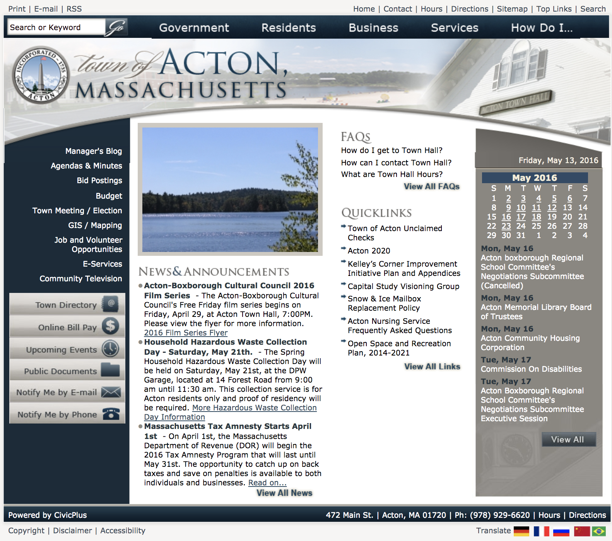
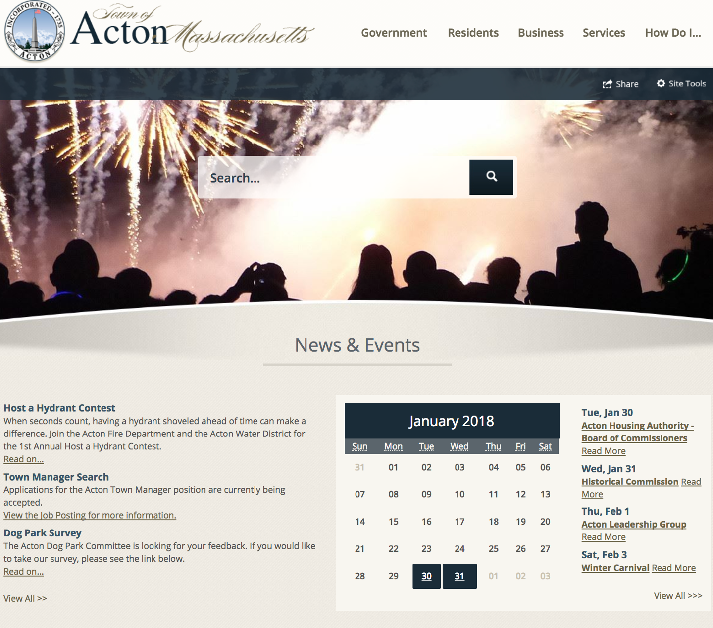

In 2016, the Town of Acton realized there was an opportunity to make important information about the Town more accessible for residents by redesigning their website.

As the Town’s webmaster, I lead the project and made sure we addressed the feedback we’d be hearing from residents: it was difficult to find information. Folks pointed out that the large nested menus were hard to navigate, having two separate and un-connected document repositories were confusing, and it was hard to know what to pay attention to when visiting the site.

    
        Acton's old website
    </img></img-div>
    
        Acton's re-designed website
    </img></img-div>
</img-wrapper>

We addressed these concerns in a variety of different ways when thinking about the new site:

* We made the homepage longer and stopped compressing everything we needed to fit onto the page in a small area. Doing that allowed us to separate out content into sections: News & Events, Online Services, Ongoing Activity, and Connect With Us that were more intuitive for users.
* We realized most users use our search bar to find what they’re looking for, so we increased it’s size and moved it to a prominent location on the page.
* We integrated our site with our other documents repository: docushare , using a Google Site Searches to help people find information across the two sites.