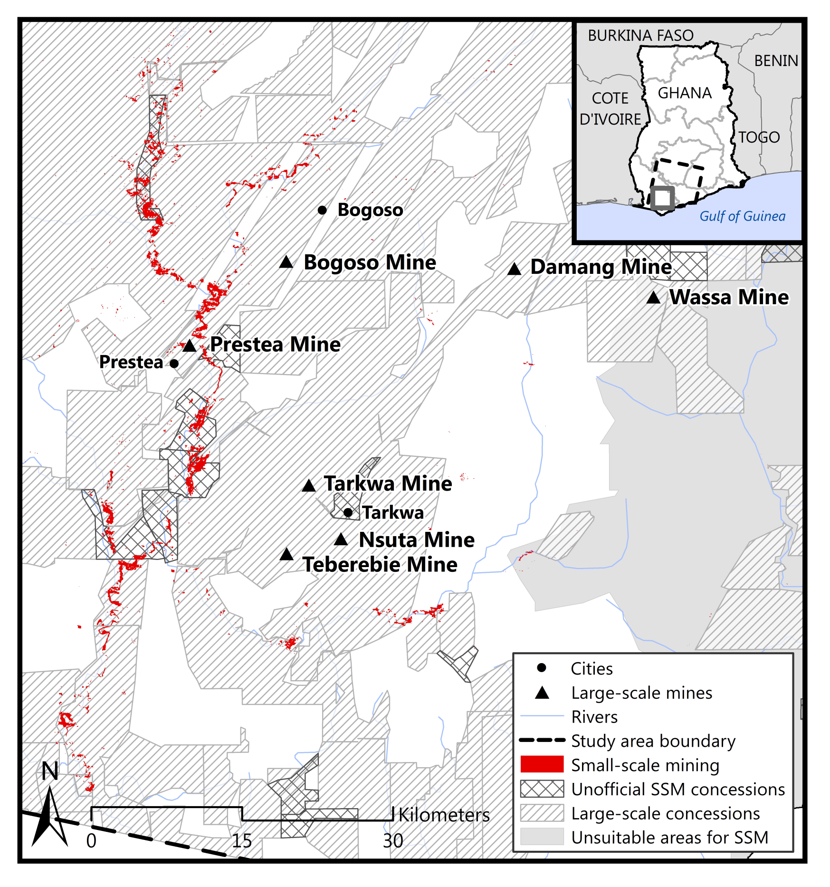

In 2016, the Town of Acton realized there was an opportunity to make important information about the Town more accessible for residents by redesigning their website.

As the Town’s webmaster, I lead the project and made sure we addressed the feedback we’d be hearing from residents: it was difficult to find information. Folks pointed out that the large nested menus were hard to navigate, having two separate and un-connected document repositories were confusing, and it was hard to know what to pay attention to when visiting the site.

    
        Figure 1: Study area is shown along with large-scale mines, regional borders, rivers, and the major geological formations running throughout the area.
    </img></img-div>
    
        Figure 2: Locations of high spatial resolution imagery from GeoEye-1, WorldView-1, and WorldView-2 used to perform map accuracy assessment on the small-scale mining maps (Landsat-7 and -8 images).
    </img></img-div>
    
        Figure 3: Map of small-scale mining (SSM) activity derived from the classification of the Landsat-7 and -8 2013 and 2015 imagery in the context of large-scale concessions, large-scale mines, unofficial small-scale mining concessions, and unsuitable small-scale mining areas.
    </img></img-div>
    
        Figure 4: Northwest region of the study area shown with the small-scale mining (SSM) derived from the 2013 and 2015 Landsat-7 and –-8 imagery in the context of the surrounding cities, large-scale mines, large-scale mining concessions, unofficial small-scale mining concessions, and unsuitable small-scale mining areas.
    </img></img-div>
    
        Figure 5: Southwest region of the study area shown with the small-scale mining (SSM) derived from the 2013 and 2015 Landsat-7 and -8 imagery in the context of the surrounding cities, large-scale mines, large-scale mining concessions, unofficial small-scale mining concessions, and unsuitable small-scale mining areas.
    </img></img-div>
    
        Figure 6: Northeast region of the study area shown with the small-scale mining (SSM) derived from the 2013 and 2015 Landsat-7 and -8 imagery in the context of the surrounding cities, large-scale mines, large-scale mining concessions, unofficial small-scale mining concessions, and unsuitable small-scale mining areas.
    </img></img-div>
</img-wrapper>