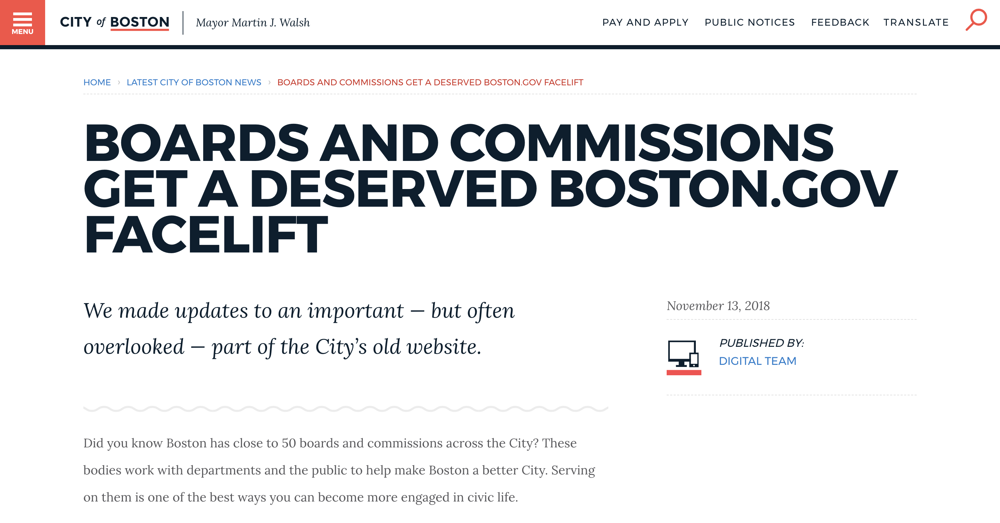

## Project Overview 
As part of modernizing boston.gov, we're slowly going through the legacy web applications we have left on cityofboston.gov and moving each over to [boston.gov](https://www.boston.gov/).

We thought it was important to make the information our boards and commissions look-up tool displays easier to find on boston.gov, so we updated the app and integrated the information it displayed into boston.gov. 

To display the data, we built custom Drupal components that contect to the database where the information is managed by our Clerk's Office. We also gave each board/commission its own boston.gov page, empowering staff to add additional information like meeting minutes and agendas. Our [Public Facilities Commission](https://www.boston.gov/departments/public-facilities/public-facilities-commission) is a good example of this idea at work.

 We wrote more about these updates and our process on the Digital Team's blog: [Boards and Commissions get a deserved boston.gov facelift](https://www.boston.gov/news/boards-and-commissions-get-deserved-bostongov-facelift).

 ## Quicklinks
 * [Blog post](https://www.boston.gov/news/boards-and-commissions-get-deserved-bostongov-facelift)
 * [Updated board and commission search page](https://www.boston.gov/civic-engagement/boards-and-commissions)
 * [The new components on boston.gov](https://www.boston.gov/historic-district/back-bay-architectural-district#commission-information)

---

    

        
    

