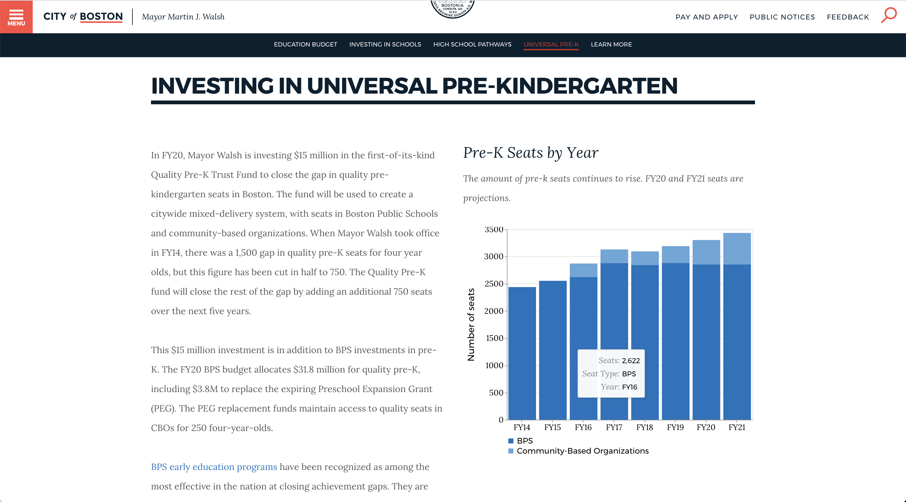

## Project Overview 
Each year, the City of Boston's Budget Department writes the [Budget Book](https://www.boston.gov/sites/default/files/embed/file/2019-09/1a-volume_1_-_executive_summary.pdf) that outlines and describes the next fiscal year's budget and allocates resources across departments and programs. 

For FY2020, I worked with the Budget Department to integrate relevant information about the City's new budget into boston.gov. We:
* restructured the Fiscal Year Budget content 
* brought down the reading level of the content to at or near 8th grade bringing it inline with our [site writing guidlines](https://www.boston.gov/departments/digital-team/city-boston-writing-guide)
*  added three new open datasets to the [City's open data portal](https://data.boston.gov/)
*  built out [interactive charting component](https://www.boston.gov/departments/budget/fy20-operating-budget#revenue) for use throughout boston.gov. 

## Tech
In addition to project managing the content side of this project, I also product managed and developed the interative charting component we created for it. 

The charts component on boston.gov is implemented similarly to our [maps component](/projects/maps-boston-gov/), as a web-component we drop on a boston.gov page when needed. 

The charts leverage the [Vega](https://vega.github.io/vega/) and [VegaLite](https://vega.github.io/vega-lite/) libaries for rendering. Users supply valid Vega/VegaLite json to the components config prop, we then maniuplate the passed spec and rendered chart to fit our needs on boston.gov and display it on the page.  

The [code for the charts](https://github.com/CityOfBoston/patterns/blob/develop/web-components/chart/chart.tsx) is on github.

---

    

        
    

