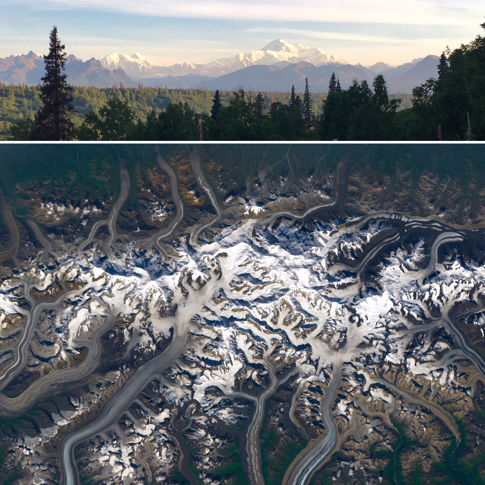
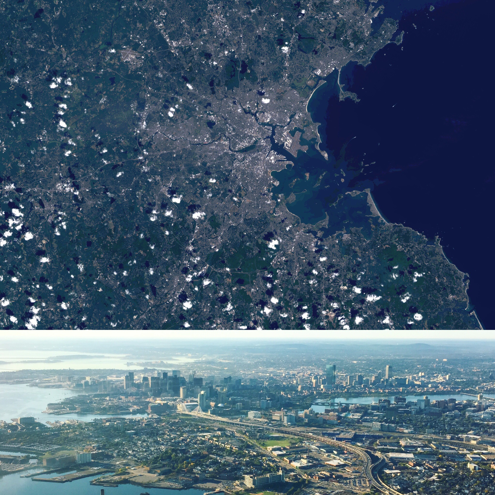

Not only does the data captured by NASA's earth observing satellites offer great opportunities for analysis, it also makes for some beautiful images. I used Landsat-8 data and GIMP, an open source image editing software, to create the statellite images seen below,and I think placing these images next to ground photos taken in those locations on the ground offers a really interesting perspective.

    
        Venice, Italy Left: Landsat-8 564 false color image captured 4/19/2015; Right: Photo taken in August 2008. The band combination in the left image uses the NIR (5), SWIR (6), and Red (4) bands. Urban areas appear grey in this band combination, seen on this fish-shaped island of Venice proper in the center of the image. Vegetation shows as shades of browns with darker colors indicating a higher soil moisture content, a little bit of which can be seen in the in the coastal areas above the island.
    </img></img-div>
    
        Denali, AK True color composite (432). Landsat 8 OLI; July 22, 2017. Denali from the Southern view point on July 23, 2017.
    </img></img-div>
    
        Boston, MA True color composite (432). Landsat 8 OLI; August 30, 2016. Boston from a statellite and a plane - the top shows the city from Landsat-8's point of view, and the bottom image was taken from a plane.
    </img></img-div>
    
        Provincetown, MA True color composite (432). Landsat 8 OLI; October 8, 2015. The very tip of Cape Cod, MA can be seen in this image in true color.
    </img></img-div>
    
        Athens, Greece Left: Landsat 8 natural color image (753) captured 9.11.2015; Right - view of Lykavittos Hill from the Acropolis captured late August 2015. The image on right shows a burn scar (red patch) in the lower right portion of the image due to July 2015 fires throughout southern Mount Ymittos.
    </img></img-div>
</img-wrapper>