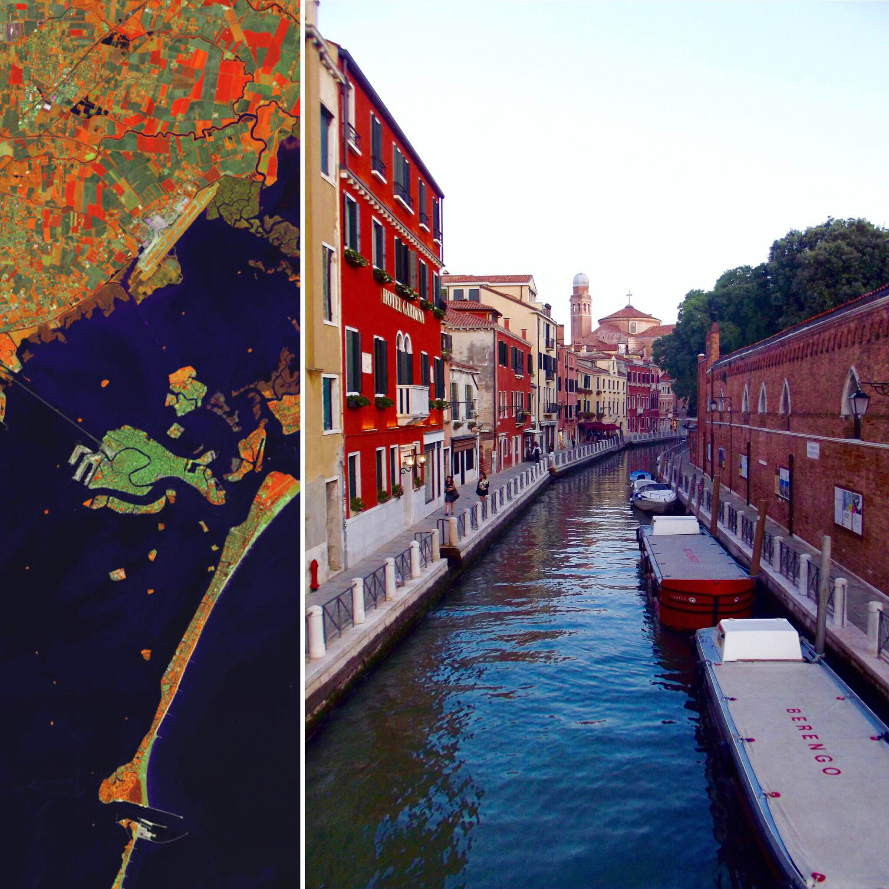
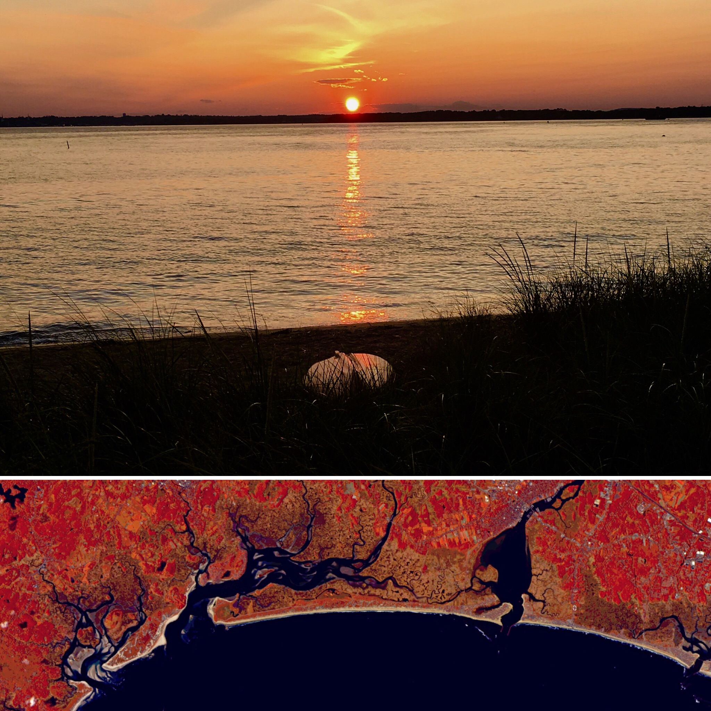

Below are a series of images I’ve taken next to the same location captured by one of our Earth observing satellites, mainly [Landsat-8](https://landsat.gsfc.nasa.gov/landsat-data-continuity-mission/) or [Sentinel-2](https://sentinel.esa.int/web/sentinel/missions/sentinel-2). I make these for no other reason than to enjoy the difference in perspective they offer and play around with satellite imagery.

In putting them together, I mainly follow the workflow laid out in this [series of articles](https://medium.com/@robsimmon/making-sense-of-satellite-data-an-open-source-workflow-accessing-data-8f7f3c30f151) written by [Rob Simmon](https://twitter.com/rsimmon). It involves using [GDAL](https://www.gdal.org/), a library for working with geospatial data, to process the raw satellite data, and [GIMP](https://www.gimp.org/), and open-source image editing software, to further enhance the image. I then use Instagram to stick them next to an image I’ve taken.

    

        
            

                Venice, Italy eft: Landsat-8 564 false color image captured 4/19/2015; Right: me 08/2015 right after I got pooped on by a pigeon.
            

    

    

        
            

                Denali, AK A typically cloud-covered Denali from up there and down here. Top: a very luck me on 07/23/2017 Bottom: a similarly lucky Landsat-8 on 07/22/2017.
            

        

    

        
            

                Boston, MA Hometown from far from the ground and farther from the ground. Top: true color composite (432) courtesy of Landsat 8 OLI on August 30, 2016. Bottom: me from a plane.
            

    

    

        
            

                Plumb Island, MA OH those summer nights Top: me late summer 2017 Bottom: False color composite (652) captured by Sentinel-2 on September 27, 2017.
            

    

    

        
            

                Leon Dormido, Ecuador Top: Leon Dormido sitting off the coast of San Cristóbal Island, Galapagos as viewed by Landsat-8. Bottom: me from a boat.
            

    

    

        
            

                Figure 6: True color composite (432). Landsat 8 OLI; October 8, 2015.
            

    

