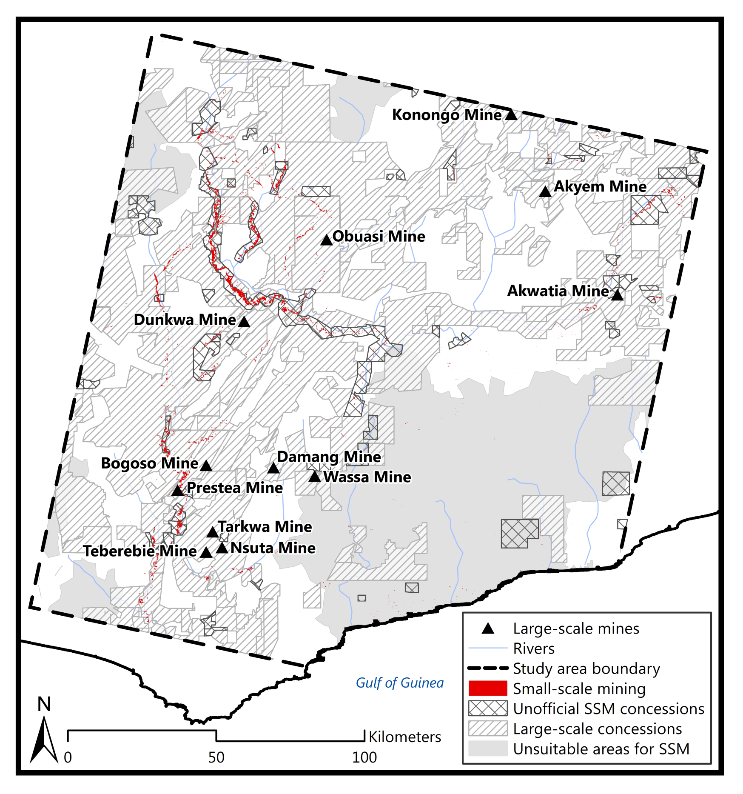
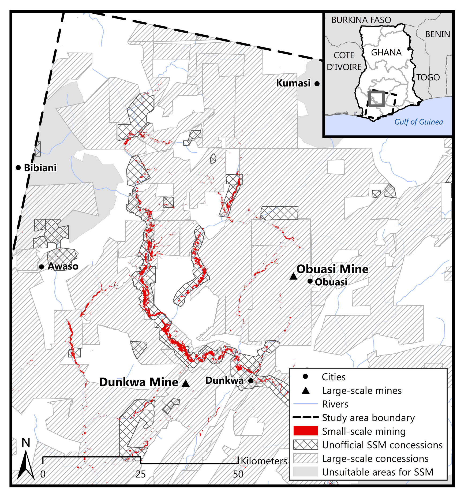
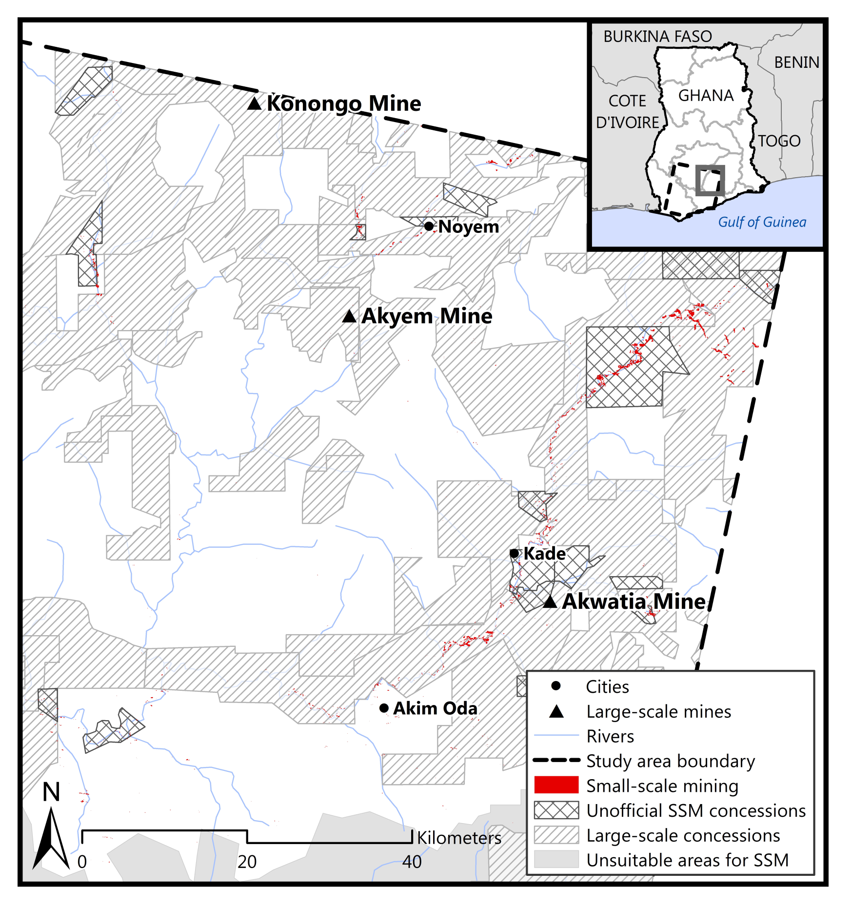

In January of 2016, the journal _Extractive Industries and Society_ accepted my masters thesis as an original research article: [Evaluating conflict surrounding mineral extraction in Ghana: Assessing the spatial interactions of large and small-scale mining](https://www.sciencedirect.com/science/article/pii/S2214790X16300065).

The work examines the spatial interactions of small and large-scale miners in south-central Ghana. A [random forest classifier](https://clarklabs.org/classification-tree-analysis/) was used to identify small-scale mining in [Landsat](https://landsat.gsfc.nasa.gov/) imagery, and these areas were then compared to the locations of large-scale mining concessions.

Below are are the abstract and figures from the paper.

---

> Since implementation of its Economic Recovery Program in 1983, Ghana’s
> extractive industries have come to account for 40% of the total value of
> the country’s exports. An adverse impact of this increase, however, has
> been increased extraction-related conflict due to heightened competition 
> between large and small-scale operators over mineral-rich ands. This
> paper characterizes these conflicts in the south-central section of the
> country by mapping the spatial overlaps between large and small-scale
> miners. Classification tree analysis of 2013 and 2015 Landsat- 7 and -8
> imagery was used to identify small-scale mine sites. The overlaps
> between these sites and large-scale concessions are examined in the
> context of reported mining conflicts. Results reveal that there is a
> large amount of resource competition between the two parties,
> specifically, more than half (i.e., 52%) of the identified small-scale
> mining activity occurs within the boundaries of large-scale concessions.
> The northwest corner of the study area contains 50% of the identified
> overlaps; the southwest corner contains 40%; and the northeast corner
> contains 10%. In most cases, these overlaps take place on prospecting
> concessions. The work illustrates how mapping and quantifying areas of
> spatial overlap between large and small-scale miners can help
> stakeholders implement more effective policy solutions.

---

    

        
            

                Figure 1: Study area is
                shown along with large-scale mines, regional borders, rivers, and the
                major geological formations running throughout the area.
            

    

    

        
            

                Figure 2: Locations of high
                spatial resolution imagery from GeoEye-1, WorldView-1, and WorldView-2 used to perform map accuracy assessment on the small-scale mining maps (Landsat-7 and -8 images).
            

        

    

        
            

                Figure 3: Map of
                small-scale mining (SSM) activity derived from the classification of
                the Landsat-7 and -8 2013 and 2015 imagery in the context of
                large-scale concessions, large-scale mines, unofficial small-scale
                mining concessions, and unsuitable small-scale mining areas.
            

    

    

        
            

                Figure 4: Northwest region
                of the study area shown with the small-scale mining (SSM) derived from the 2013 and 2015 Landsat-7 and –-8 imagery in the context of the surrounding cities, large-scale mines, large-scale mining concessions, unofficial small-scale mining concessions, and unsuitable small-scale mining areas.
            

    

    

        
            

                Figure 5: Southwest region
                of the study area shown with the small-scale mining (SSM) derived from the 2013 and 2015 Landsat-7 and -8 imagery in the context of the
                surrounding cities, large-scale mines, large-scale mining concessions, unofficial small-scale mining concessions, and unsuitable small-scale mining areas.
            

    

    

        
            

                Figure 6: Northeast region
                of the study area shown with the small-scale mining (SSM) derived from the 2013 and 2015 Landsat-7 and -8 imagery in the context of the
                surrounding cities, large-scale mines, large-scale mining concessions, unofficial small-scale mining concessions, and unsuitable small-scale mining areas.
            

    

