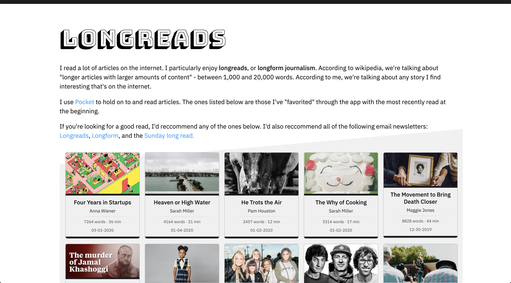

## Project Overview
I read a lot of articles on the internet. I particularly enjoy longreads, or longform journalism. According to wikipedia, we're talking about "longer articles with larger amounts of content" - between 1,000 and 20,000 words. According to me, we're talking about any story I find interesting that's on the internet.

I use [Pocket](https://getpocket.com/) to hold on to and read articles. The ones listed in [the app](https://longreads.now.sh/) are those I've "favorited" through the app with the most recently read at the beginning.

If you're looking for a good read, I'd reccommend any of the ones below. I'd also reccommend all of the following email newsletters: [Longreads](https://longreads.com/newsletter/), [Longform](https://longform.org/newsletter), and the [Sunday Long Read](https://sundaylongread.com/).

## Tech
This app is put together using NextJS and React. The data comes from the [Pocket api](https://getpocket.com/developer/). The code can be found on [github](https://github.com/paylakatel/longreads).

## Quicklinks
* [Longreads app](https://longreads.now.sh/)
* [Code on github](https://github.com/paylakatel/longreads)

---

    

        
    

