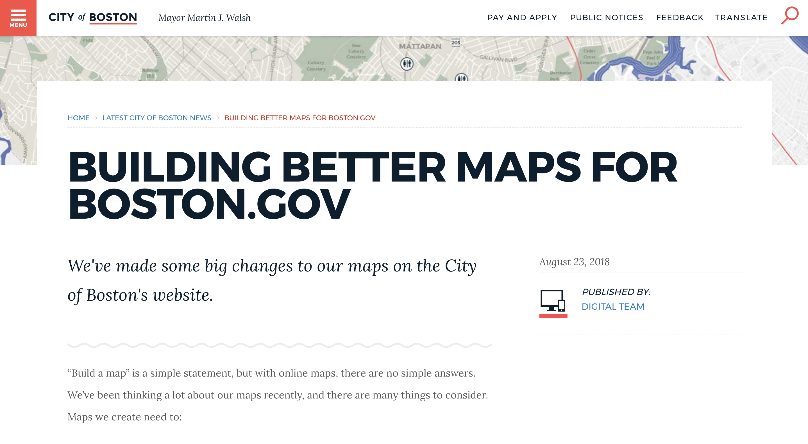

In late 2018, we made improvements to how we get maps on [boston.gov](https://www.boston.gov/). We wrote about the updates on the Digital Team's blog: [Building better maps for boston.gov](https://www.boston.gov/news/building-better-maps-bostongov).

From a technical stand point, we leveraged [web components](https://github.com/CityOfBoston/patterns/tree/develop/web-components/map) that we wrapped up in a custom Drupal component. The web component uses [esri-leafet](https://esri.github.io/esri-leaflet/) which lets us integrate with our data hosted on [ArcGIS Online](http://boston.maps.arcgis.com/home/index.html).

--- 

    

        
    

