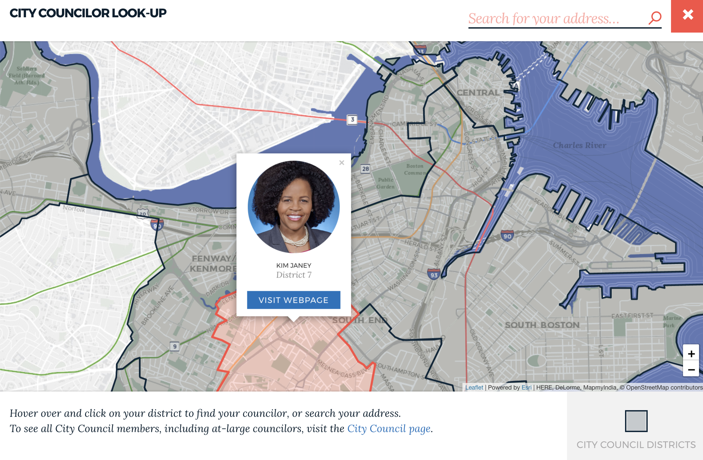

## Project Overview
In late 2018, we made improvements to how we get maps on [boston.gov](https://www.boston.gov/). The product goals were to:
* Fully integrate with Drupal, boston.gov's CMS
* Fit the [city's brand](https://www.boston.gov/departments/innovation-and-technology/brand-guidelines)
* Integrate with the infrastructure our Analytics Team uses to share data (ArcGIS Online)
* Be easy to update
* Be mobile reponsive and nice to use

We built a custom Drupal component so maps could be placed on any page and leveraged hosted data sources maintained by our data team. We wrote more about these updates on the Digital Team's blog: [Building better maps for boston.gov](https://www.boston.gov/news/building-better-maps-bostongov).

## Tech
From a technical stand point, we leveraged [web components](https://github.com/CityOfBoston/patterns/tree/develop/web-components/map) that we wrapped up in a custom Drupal component. The web component uses [esri-leafet](https://esri.github.io/esri-leaflet/) which lets us integrate with our data hosted on [ArcGIS Online](http://boston.maps.arcgis.com/home/index.html).

## Quicklinks
* [A map on boston.gov](https://www.boston.gov/departments/311/public-restrooms-city-boston#map--239796)
* [Blog post](https://www.boston.gov/news/building-better-maps-bostongov)
* [Code for the maps](https://github.com/CityOfBoston/patterns/tree/develop/web-components/map)

--- 

    

        
    

