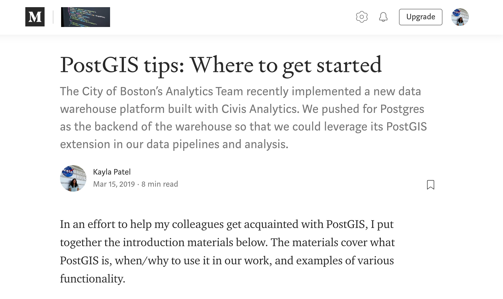

The City of Boston’s Analytics Team recently implemented a new data warehouse platform built with [Civis Analytics](https://www.civisanalytics.com/). We pushed for Postgres as the backend of the warehouse so that we could leverage its [PostGIS](https://postgis.net/) extension in our data pipelines and analysis.

In an effort to help my colleagues get acquainted with PostGIS, I put together a series of introduction docs:

- [PostGIS tips: Where to get started](https://medium.com/innovation-and-technology/part-1-postgis-at-the-city-of-boston-9476293d71c2)
- [PostGIS tips: Working with geometry columns and projection systems](https://medium.com/@paylakatel/part-2-postgis-at-the-city-of-boston-711cf30cf1f3)
- [PostGIS tips: How to get insights from your data](https://medium.com/@paylakatel/part-3-postgis-at-the-city-of-boston-98b83b0d1503)

---

    

        
    

