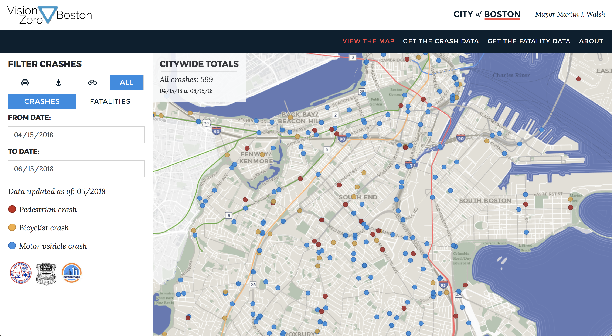

## Project Overview
Vision Zero is an international road saftey effort with the goal of ending fatalities and serious injuries related to road traffic. [Vision Zero Boston](https://www.boston.gov/transportation/vision-zero) is the City’s local program. As part of that effort, the City tracks traffic crashes and fatalities on the [Vision Zero Crash Map](https://apps.boston.gov/vision-zero/).

In Summer 2018, we re-built the crash map to bring it inline with Boston’s branding, modernize the technology stack, and automate the updating process. I was in charge of the frontend and the geospatial queries the map uses in the backend.

## Tech
The map leverages [PostGIS](https://postgis.net/), [Mapbox GL JS](https://docs.mapbox.com/mapbox-gl-js/api/) for displaying and visualizing the data, and [React/NextJS](https://nextjs.org/). When a crash is reported, it gets geocoded to the nearest address in our 911 software. We leverage PostGIS throughout the data pipeline to snap the crash to the nearest location on the street in occured on. We do this in an effort to reduce confusion on the user-facing map.

The [code for the web map](https://github.com/CityOfBoston/vision-zero) can be found on github.

## Quicklinks
* [Boston's Vision Zero public facing map](https://apps.boston.gov/vision-zero/)
* [Code for the frontend](https://github.com/CityOfBoston/vision-zero)

---

    

        
    

